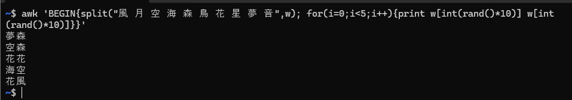
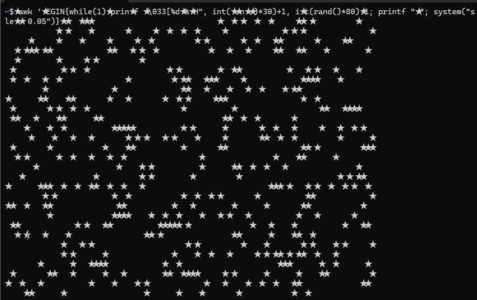

<!--
headingDivider: 2
-->

# awkで遊ぶ

## awkって何？
- テキスト処理によく利用されるコマンド
    - ファイル入力や，コマンドの出力のパイプに対して処理
    - 列を抽出

**実はプログラミング言語（演算ができる）**

## よく使う例
`$ ps aux | awk '{print $1}' | sort | uniq`

- `awk '{print $1}'`の部分で`ps aux`（全てのプロセス）の1列目（ユーザ名）を抽出し，その結果をソートしてユニークな文字列を出力

## ビープ音をひたすら流す
- `awk 'BEGIN{while(1){printf "\a"; system("sleep " rand())}}'`
- `\a`はベル文字（ビープ音や画面のフラッシュ）を示す
- **修了する際はもう一つターミナルを開いて，`ps aux | grep awk`で PID を確認して，`kill -9 プロセスID`する**

## 好きな人は好きな単語を生成する
- `awk 'BEGIN{split("風 月 空 海 森 鳥 花 星 夢 音",w); for(i=0;i<5;i++){print w[int(rand()*10)] w[int(rand()*10)]}}'`
- for 文で5周ループ
- 10個の文字の中からランダムに2つ抽出して表示

## カラフルなランダムの文字を表示
- `awk 'BEGIN{while(1){printf "\033[3%dm%c\033[0m", int(rand()*8), 33+int(rand()*94)}}'`
- `\033[3%dm`でランダムな色を指定
- `%c`でランダムな文字を指定
- `\033[0m`で修了時に色をリセット

## ランダムな場所に★を表示
- `awk 'BEGIN{while(1){printf "\033[%d;%dH", int(rand()*30)+1, int(rand()*80)+1; printf "★"; system("sleep 0.05")}}'`
- `\033[%d;%dH`でカーソルをランダムな位置に移動させて，そこに★を表示
- **修了する際はもう一つターミナルを開いて，`ps aux | grep awk`で PID を確認して，`kill -9 プロセスID`する**

## デモンストレーション
遊んでみます

## 最後に
いろいろできておもしろい