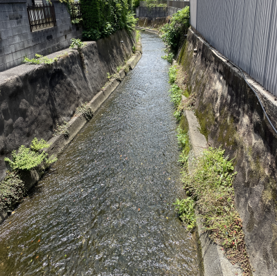
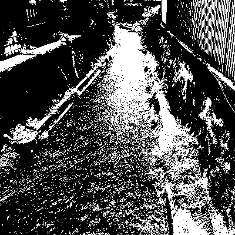
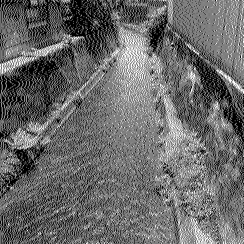
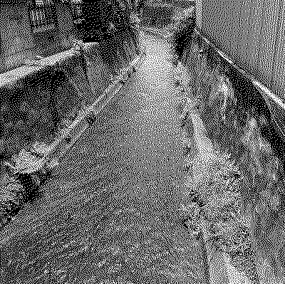

<!--
headingDivider: 2
-->

# ディザリング画像処理

## ディザリングとは
- 画像ファイルの容量を削減（量子化）する際する際，丸め誤差が発生する
- あるピクセルで出現した誤差を，隣接する複数のピクセルに投げつけることを繰り返す **（ディザリング）**
    - 画像全体に出現する量子化の際の誤差が小さくなる
    - 見やすさ，芸術性

https://github.com/yif11/dithering_py

## ナイーブな量子化
画像をグレースケールに変換し，各ピクセルを 0 or 255 に変換
 

## 誤差を右隣に拡散
あるピクセルの誤差をそのまま右隣に拡散（重み1）
ナイーブなものより少し自然に見えるが，ところどころ違和感がある
 

## Floyd-Steinberg Dithering
誤差を，右隣と左下，下，右下方向にそれぞれ 7/16, 3/16, 5/16, 1/16 の重みをつけて拡散
右隣のみへの拡散と比べて違和感が減少 & 見やすくなった
 

## Atkinson Dithering
誤差を，右と下にそれぞれ2ピクセル，左下と右下にそれぞれ1ピクセル，合計6箇所に 1/8 ずつ重みをつけて拡散 **（2/8 分の誤差は捨てられる）**
Floyd-Steinberg Dithering より誤差が大きいが，逆に良い印象を受ける
 

## まとめ
ディザリング手法によって印象が変わる
グレースケールで実験したが，RGBカラーの表現をする場合は3チャネル分誤差を拡散しないといけない

https://github.com/yif11/dithering_py
