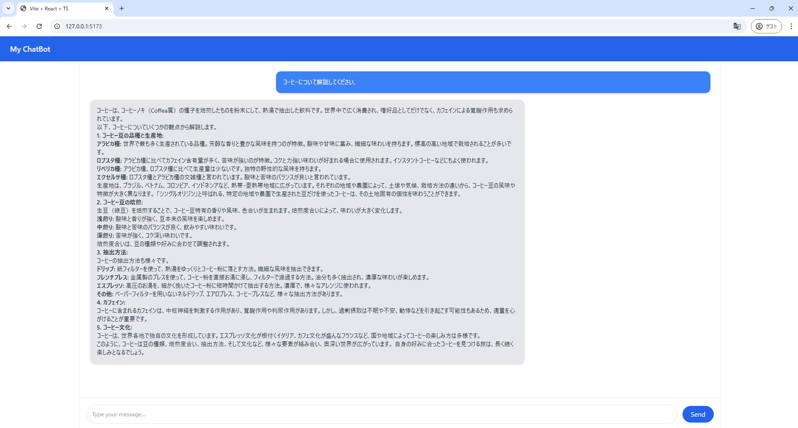

<!--
headingDivider: 2
-->

# Gemini APIでチャットボットを作ってみる

## やること
- `Gemini 1.5 Flash`のAPIを使ってブラウザから使えるチャットボットを作ってみる
    - エンドポイント(リクエストを投げる先)にリクエストを送るだけなので意外と簡単
    - APIキーとかエンドポイント，ペイロード(受け取るデータの形式)を変えれば他のモデルにも対応可能(なはず)

## 必要な機能
- リクエストを送って，その応答を処理する部分
    - `axios`で通信
    - マークダウンを返されるため，`react-markdown`で解析
- チャット履歴を表示する部分
    - 某SNSのように表現

## 処理
- [GitHub](https://github.com/yif11/gemini_app)にソースを公開しています
```
// サーバーにメッセージを送信
const response = await axios.post(
    `https://generativelanguage.googleapis.com/v1beta/models/gemini-1.5-flash-latest:generateContent?key=${API_KEY}`,
    { contents: [{ parts: [{ text: input }] }] },
    { headers: { "Content-Type": "application/json" } }
);

// サーバーからの応答を処理して、チャットに追加
const botContent = response.data?.candidates?.[0]?.content?.parts?.map((p: { text: string }) => p.text).join("\n") || "";
setChatHistory((prev) => [...prev, { role: "system", content: botContent }]);
```

<!--
_footer: "https://github.com/yif11/gemini_app"
-->

## 例


## デモンストレーション
見せます

## 結論
- 意外とサクッと作れて，他のモデルにも応用可能
- Gemini 1.5 Flashはロングコンテキスト対応
    - pdfを文字起こししてQAチャットボットも作れる(次回実装)