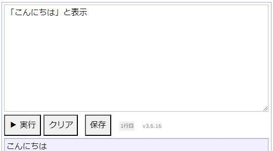

<!--
headingDivider: 2
-->

# 【ギャルでもできる】プログラミング言語「なでしこ」であげぽよ

## 背景・目的
簡単にプログラミングに入門したい人に教える言語

| 例1           | 例2           |
| ------------- | ------------- |
|  |  |

**ギャル語でカワイく書きたいっしょ**

## なでしこ
>『日本語プログラミング言語「なでしこ」』は日本語でプログラミングできる言語です。「誰でも簡単プログラマー」が目標です。

>なでしこは日本語を基にしたプログラミング言語です。直感的で分かりやすく、日々の作業自動化やプログラミング学習にもぴったりです。オープンソースなので誰でも気軽にはじめられます。
(→⭐ブラウザで試してみよう)

<!--
_footer: "https://nadesi.com/"
-->

## print文

## 加算

## 文字列操作

## if文

## for文

## ゲームとかプラグインも作れちゃうのマジやばくね？しかも共有できるとかアゲなんですけど

<!--
_footer: "https://n3s.nadesi.com/"
-->

## デモンストレーション
見せるっしょ

## 結論
これならあーしにもできそうじゃね？