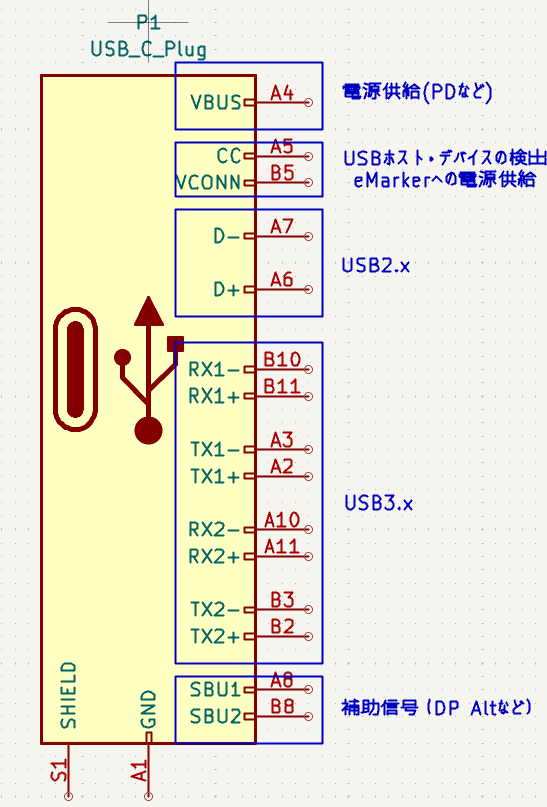
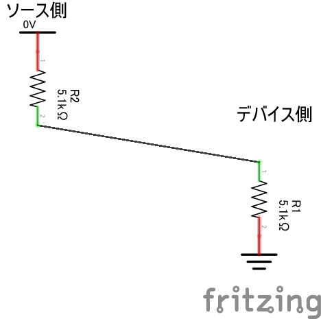

# Type-C 触ってみた
---
## 電子工作におけるType-Cの
### メリット
 - ケーブルの入手性がいい
 - 苦労なくその他のUSB規格と接続できる
 - 電源供給が楽・安全（規格が守られていれば．．．）
###  デメリット

 - ケーブルが抜ける
 - 規格が多すぎる，ケーブルの種類が多すぎる，高価
 - ケーブル自体が〇ぬ (eMarker)
---
### TypeCの信号線
<!--  -->


--- 

## 電子工作で気にしないといけないこと
### CC信号線の処理（5Vが欲しいとき）
- デバイス側・シンク側として使うことがほとんど
  - CCを5.1kΩでGNDに接続
  - プルダウン側が電源受電側(シンク) 
  - プルアップ側が電源供給側(ソース)　抵抗値が供給可能電流
<!--  -->


--- 
### PDで電源供給したいとき
- 専用のICにCCをつないで処理を任せる　例）CH224K
- おすすめ(省スペースで便利，考えたくない電源を外部に任せられる)
--- 

### ちょっとやってみる
- Raspi Pico 2 Micro Python
- 対話型シェルでGPIOを制御して，PD出力電圧をいじってみる
```
from machine import Pin
pin_cfg1 = Pin("GP22", Pin.OUT)
pin_cfg2 = Pin("GP17", Pin.OUT)
pin_cfg3 = Pin("GP16", Pin.OUT)
pin_led = Pin("LED", Pin.OUT)

pin_led.toggle()
pin_cfg1.toggle() // 5V出力  cfg1:1, cfg2:0, cfg3:0
pin_cfg1.toggle() // 9V出力  cfg1:0, cfg2:0, cfg3:0
pin_cfg3.toggle() // 12V出力 cfg1:0, cfg2:0, cfg3:1
pin_cfg2.toggle() // 15V出力 cfg1:0, cfg2:1, cfg3:1
pin_cfg3.toggle() // 20V出力 cfg1:0, cfg2:1, cfg3:0
```

