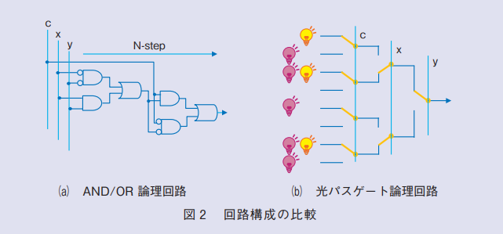

# 光電融合チップとは

---

### これまで

- 長距離の伝送路での光技術を用いた通信
  - 海底ケーブル
  - 電線・電柱 　<--　よく使う光回線
    - 自宅まで光ファイバーで引いてきて，ONU でデジタル信号に変換

---

### これから

- 光伝送経路の**短距離化** - データセンター内の通信領域で実用化が進んでいる - チップ間通信・チップ内通信 - 光電融合チップはこの最高到達点
  
  ※引用 https://www.rd.ntt/_assets/img/iown/0002/fig4.jpg

---

### 光電融合チップのメリット

- 従来のデジタル信号と光通信を組み合わせる
  - 従来のデジタル信号を用いた通信
    - チップ内の配線で損失が生まれる
  - チップ内で光伝送を行うことで配線で生まれる損失をなくす
- 消費電力・発熱量の低減

---

### 光電融合チップのメリット

- 光の性質を使った演算用チップ・光トランジスタなるものもあるらしい
  - n 段の論理演算が光スイッチを使うと高速にもとまる

※引用: [NTTジャーナル 2018年5月号 PDF 図２] (https://journal.ntt.co.jp/backnumber2/1805/files/JN20180528.pdf)

---

※引用 https://journal.ntt.co.jp/wp-content/uploads/2020/07/08_04_1.jpg

---

### 最近の動向

- TSMC が光電融合チップに乗り出すことを発表
  - 2025 年に第一世代チップを公開予定

### 参考資料

- [NTT 研究所](https://www.rd.ntt/iown/0002.html)
