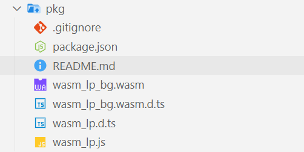
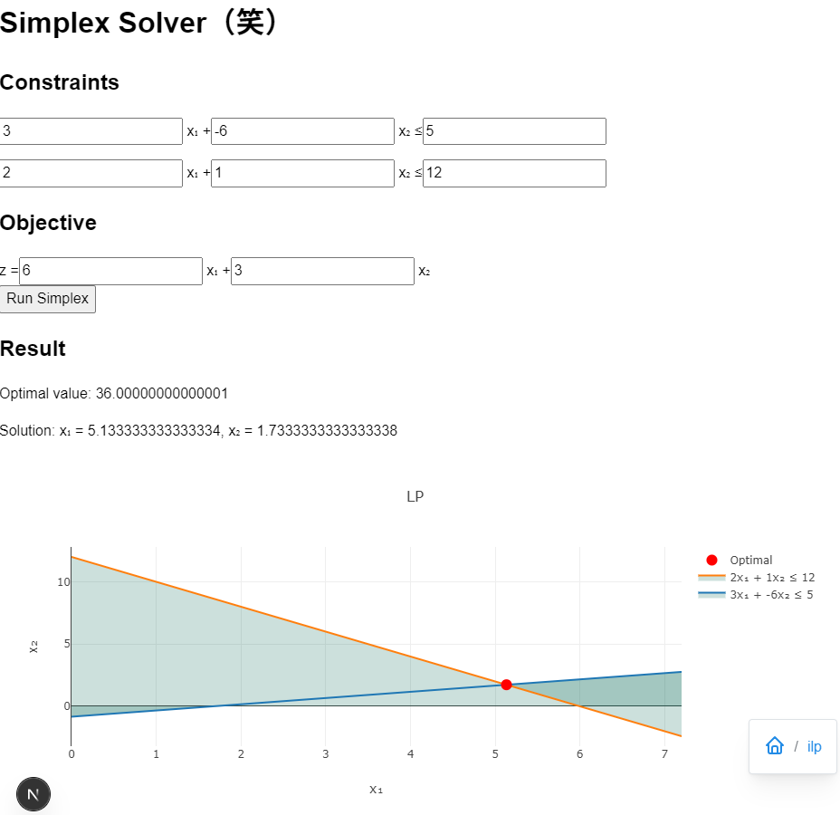

## Web Assemblyとは？

- ブラウザ上で実行できるバイナリコード，拡張子は`.wasm`
  - c++やrust,goなどからコンパイルする環境が整っている
  - ブラウザさえあれば，どこでも動く！！
- javascriptでは処理に時間がかかりすぎる計算の高速化
  - javascriptよりも低層の命令を扱える

---

## RustからWeb Assemblyを出力する

```
cargo install wasm-pack
webpack new {プロジェクト名}
cd {プロジェクト名} && wasm-pack build --target web
```
で出力されたものをWebアプリケーションで取り込むだけで簡単に実行できる．
ビルド結果：(javascriptから呼べるwrapperとwebassembly)



---

## Web Appから呼び出す (NEXTjs v15の例)

```
'use client';
import { useEffect, useRef, useState } from 'react';
export function useWasm(
    loader: () => Promise<{ default: () => Promise<any>; Simplex: any }>
) {
    const [module, setModule] = useState<Awaited<ReturnType<typeof loader>> | null>(null);
    const [error, setError] = useState<Error | null>(null);
    const didLoadRef = useRef(false);

    useEffect(() => {
        if (didLoadRef.current) return;
        didLoadRef.current = true;

        loader()
            .then(async (mod) => {
                await mod.default();
                setModule(mod);
            })
            .catch((e) => {
                console.error('Cannot Load:', e);
                setError(e as Error);
            });
    }, [loader]);

    return {
        module: module,
        loading: module === null && error === null,
        error,
    } as const;
}

```

---
## Web Appから呼び出す
- 動的インポートを行う(こういうの本当によく沼る)
```
const loader = useMemo(() => () => import('@/pkg/wasm_lp'), []);
```
- 今回は，全く関係ないけどシンプレックス法を実装してみた
- 本当は，MILPのソルバーもどきが作りたかったけど，まだ実装方法がよくわかってない．．．
---
## 動作確認

