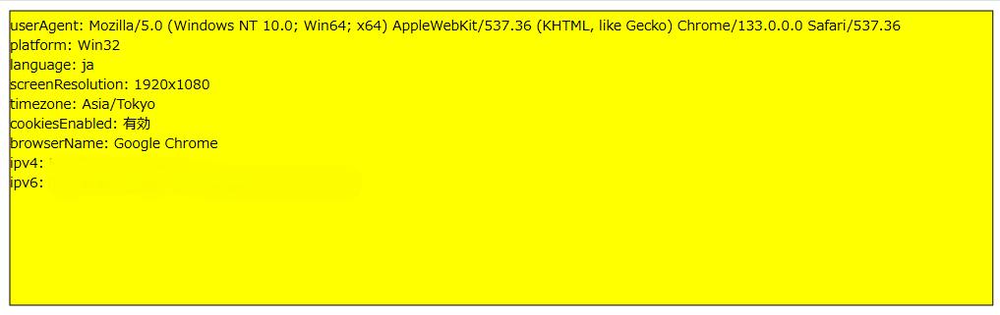

<!--
headingDivider: 2
-->

# `.svg`の危険性

## 話題
- リポジトリとかDockerfileにマルウェアが仕込まれてたって話題を見かけた
- 似たような話で，`.svg`ファイルにJSを仕込む攻撃の話

## `.svg`とは
- XMLベースのマークアップ言語
- 座標情報によるベクター形式のデータ
    - 拡縮や解像度による画質の変化がない
- SMIL(XMLベースのマークアップ言語)でアニメーションや動画・音声を制御できる
- **JavaScriptで操作可能**

## `.svg`にJSを埋め込んでみる
- `<![CDATA[]]>`: XMLとして解釈されないように(文字列として解釈されるように)するセクション
```xml
<?xml version="1.0"?>
<!DOCTYPE svg PUBLIC "-//W3C//DTD SVG 1.1//EN" "http://www.w3.org/Graphics/SVG/1.1/DTD/svg11.dtd">
<svg xmlns="http://www.w3.org/2000/svg" xmlns:xl="http://www.w3.org/1999/xlink" version="1.1" width="100pt" height="100pt">
    <script>
        //<![CDATA[
            // JSを記述
        //]]>
    </script>
</svg>
```

**悪意のあるコードを埋めることができる．JSの内容によっては危険にさらされる．**

## ファイルを開く
- `.svg`ファイルをブラウザでそのまま開けばJSが発火する
- `.html`とかから開くためには以下のようにする: 

```html
<body>
  <object data="./test.svg" type="image/svg+xml"></object>
   <!-- JSが動かない．test.svgを直接ブラウザで開くことがないなら安全？ -->
</body>
```

- ためしに作成したファイル: https://github.com/yif11/svg

## 実行結果
IPアドレスやブラウザ，ユーザエージェントなどの情報を表示してみる

