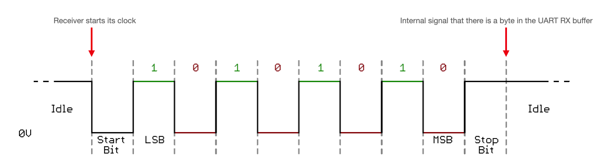

# 単純で無責任なUART

---

## UARTとは

- Universal Asynchronous Receiver/Transmitter の略
- 非同期シリアル通信の一種
  - 調歩同期式(同期とついているが非同期)
  - 信号に同期用ビットを付加して送る
- 1バイトごとに送受信できるのでとても単純
- ヘッダなどもなく目でデコードするのも容易い
  - (慣れれば)

---

## UART信号

- Idle時Hi
- Start BitでLowに下げて送信開始を相手側に通知
- 8ビットデータ送信
- Stop BitでまたHiに上げて送信終了を通知

---

## UART送受信

- マイコン等を用いて送信する場合、決まったレジスタに1バイトずつデータをコピーすると外にデータが流れていくようになってることが多い
- 受信も同様で、データが来ると決まったレジスタに1バイトずつデータが入っているので、それを適宜取り出す
  - これが厄介

---

## 送信は簡単(無責任)、受信は大変

- UARTはマイコン間通信などにもよく使われる
- 単純な低レイヤプログラムの場合、１つの無限ループの中でひたすら処理をしていく場合がほとんど
- 相手が勝手に送りつけてくる場合、受信側はそのタイミングを知る術を持たない
- CPUによる割り込みを用いて通知する方法もあるが、これだけでは複数バイトにわたってデータを受信するのが難しい
    - 受信タイムアウトを実現したくても無限ループが一つしかない(シングルタスク)なのでブロッキングするしかなくなる
    - ロボット制御などをしている場合、通信周期に制御周期を律速しないといけなくなる

---

## RTOSを使ってマルチタスクを実現しよう

- 簡単に言えば、メインルーチン用タスクと受信用タスクの２つが並行して実行されるようになればいい
- 割り込みによる通知を使って省リソースな受信を実現していく
- 次回やるかも
