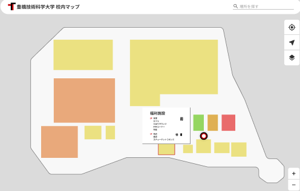

# プロジェクト概要
- [大学が公式で出しているキャンパスマップ](https://www.tut.ac.jp/about/overview/docs/campusguidemap_2023.pdf)のレスポンシブなWebAppを作る（非公式）

---

# 使用フレームワーク

- [OpenLayers](https://openlayers.org/)
  - 地図データ描画用のJavascriptライブラリ
  - 座標変換・地図上への図形の表示などが容易
  
---

# 使用地図データ
- [国土地理院実験データ](https://maps.gsi.go.jp/development/vt_expt.html)
  - 国土地理院がベクトルタイルの提供実験で全国の地図データを公開している
  
---
# 実現予定機能
- 施設名キーワードから位置が検索できる機能 (ex. 教務課)
- 位置情報からキャンパスマップに現在地を表示する機能

---

# 完成予定図（未定）

# リリース予定
  - 学園祭までに(期待)
