# ポートフォリオ作成ワークショップ - 環境構築

## 1. 拡張子の表示

ファイル名に含まれる `.jpg` や `.html` などのことを「拡張子」といいます。これをエクスプローラー上で常に表示するために設定を行います。

設定→システム→開発者向け　から　エスクプローラー　を開き、「ファイル拡張を表示する」をオンにします。

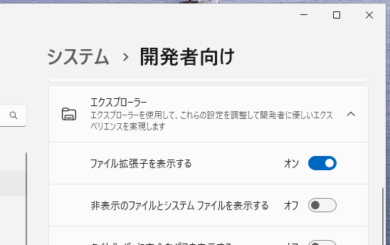

## 2. Visual Studio Code(VSCode)のインストール

プログラムを記述するためのソフトウェアである「エディタ」を用意します。テキストが編集できればいいので「メモ帳」などでも作業は可能ですが、プログラミングを行う際、大体の場合はプログラミング専用の高機能なエディタを導入して作業を行います。これにより開発効率を上げることができます。

スタートメニューからMicrosoft Storeを開き、「vscode」と検索します。

画面の通りのソフトウェアが出てきたらインストールを押します。

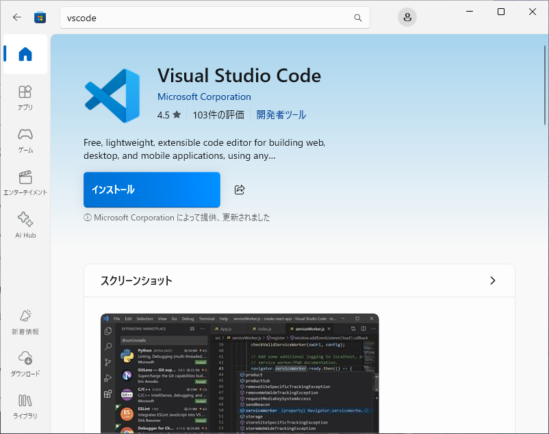

## 3. Gitのインストール

ソフトウェア開発における作業履歴を管理したり、「GitHub」のようなWebサービスにソフトウェアのソースコードを公開・共有・バックアップしたりすることを可能にするソフトウェアである「Git」をインストールします。今回のワークショップではあまり触れませんが、チームで共同開発を行う際にも非常に便利なツールなので、興味があったら調べてみてください。

https://gitforwindows.org/ にアクセスしたら「Download」を押し、ダウンロードが完了したらファイルを開き、指示に従ってインストールします。基本的にすべて「次へ」を押していれば大丈夫です。

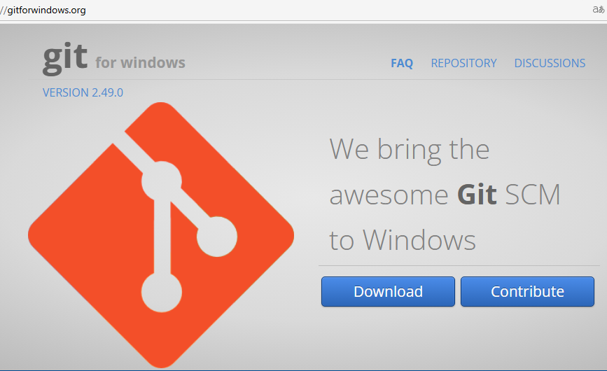

## 4. Node.jsのインストール

今回Webサイトを作るにあたって、JavaScriptという言語を使用します。JavaScriptはWebブラウザで主に用いられるプログラミング言語ですが、今回はWebブラウザの外でも動かす必要があるため、Node.jsというJavaScriptを実行するためのソフトウェアを導入します。

https://nodejs.org/ja にアクセスしたら「Node.js (LTS) をダウンロードする」を押してダウンロードしたファイルを開いてください。

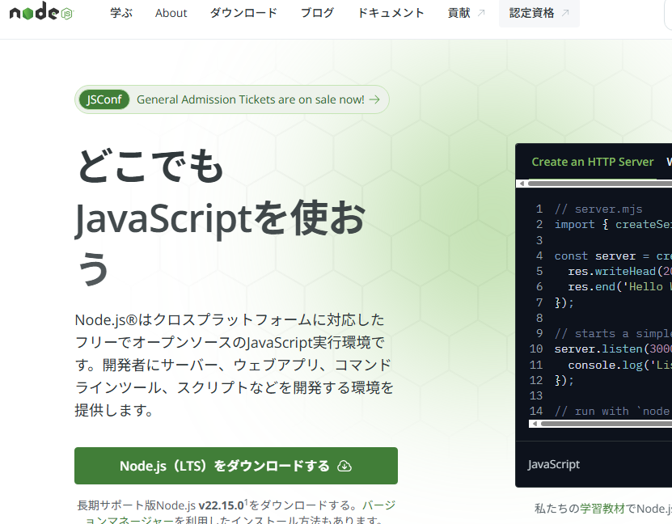

インストーラが開いたら「次へ」をクリックして進めます。

途中、以下の画面のようなページが表示されるので、**必ず「Automatically install the necessary tools, ...」にチェックを入れます。**

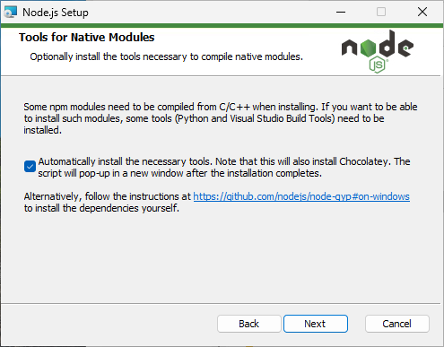

その後「続行するには何かキーを押してください...」という文言が何度か出てくるので、Enterキーなど適当なキーを押します。「Type ENTER to exit:」という文言が出てきた際も同様です。

この作業にはしばらくかかるので、その間ブラウザを開いて 5. の作業に進みます。

## 5. GitHubアカウントの作成

今回のワークショップでは、Webサイトの公開先としてGitHub Pagesというサービスを使用します。これは無料のWebサーバーだと思ってもらえればよいです。また、ソースコードをバックアップする目的でも使用します。

GitHubを使用するためにはアカウント作成を行う必要があります。

https://github.com/ にアクセスし、メールアドレスを入力して「Sign up for GitHub」を押します(大学のメールアドレスではなく、個人用メールアドレスが望ましい)。


パスワードとユーザー名を入力します。ユーザー名はポートフォリオサイトのURLに含まれること、GitHubアカウントは今後も講義や研究活動等で使う可能性があることを考慮して決定すると良いです。

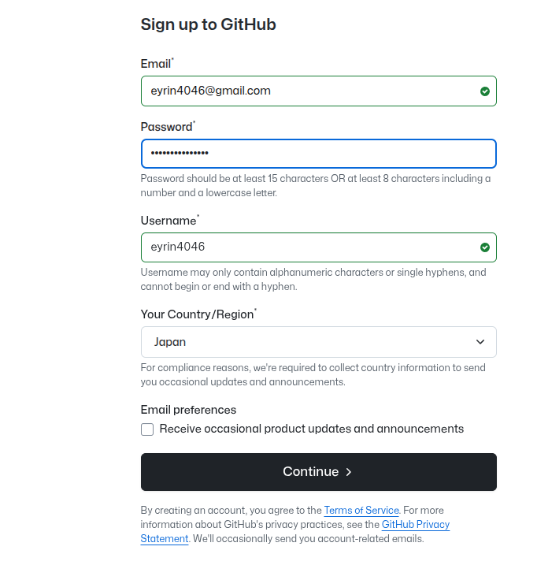

登録したメールアドレスに8桁のワンタイムコードが届くので、入力します。

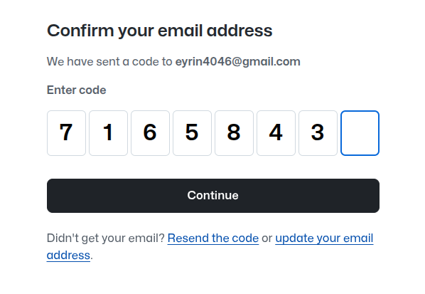

ここまででアカウントの登録が完了しました。次のログイン画面で先程決めたユーザー名とパスワードを入力しログインします。  

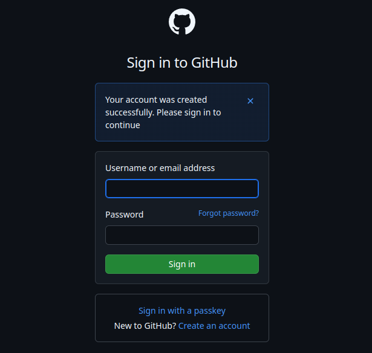

## 6. Gitに個人情報を設定

スタートメニューから「ターミナル」を開き、以下のコマンドを入力します

```pwsh
git config --global user.name "[自分の名前(本名、GitHubに設定したユーザー名など)]"
git config --global user.email "[GitHubに登録したメールアドレス]"
```

これを行うことでGitの使用を開始できます。

## 7. VSCodeの日本語化、拡張機能のダウンロード

**この手順は 4. の手順が終わってから開始してください**

VSCodeを起動すると、英語の画面が表示されるはずです。これを日本語化します。

画面左端の四角形が4つ並んだアイコンをクリックすると拡張機能(Extensions)を探すことができる画面に移動するので、検索欄に「japanese」と入力し、「日本語」と書かれたパッケージをインストールします。

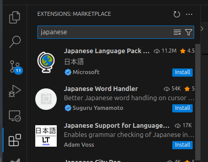

インストールが完了すると、画面右下に次のような表示が出てくるので「Change Language and Restart」をクリックします。

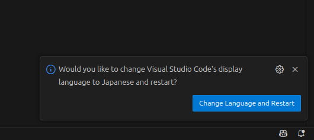

VSCodeが再起動したら再度拡張機能の検索欄に移動し「astro」と入力、画面の通りの拡張機能をインストールします。途中「発行元の信頼」のような画面が出てきたら「発行元を信頼&インストール」を押してください。

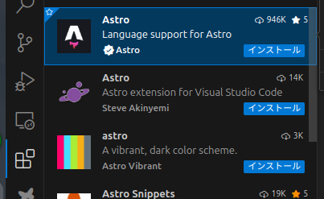

以上で、今回のワークショップにおける環境構築は完了です。