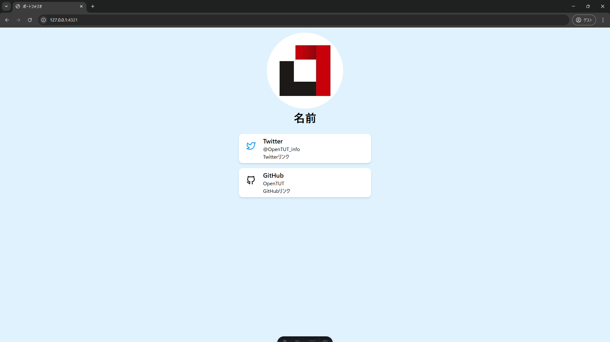
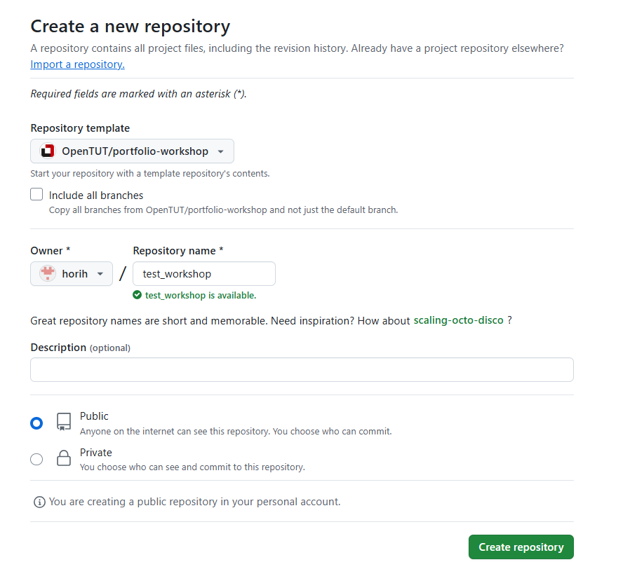

# ポートフォリオ制作ドキュメント

## 概要

このドキュメントは、モダンなフレームワークを使ってポートフォリオを作るためのチュートリアルです。

#### 使用するフレームワーク
- **Astro**  
  ウェブサイトをすばやく作れるツールです。ページの読み込みを速くし、公開用ファイルを自動で最適化してくれます。

- **TailwindCSS**  
  デザイン用の便利なクラスがたくさん用意されたCSSツールです。色や余白、フォントサイズなどをHTMLのクラスだけでかんたんに指定できます。


このチュートリアルで目指す完成品は以下の通りです．

### 完成品



## セットアップ手順
1. リポジトリを作る

    1. OpenTUTのリポジトリから自身のリポジトリにテンプレートをコピーします．
    [OpenTUTのリポジトリ](https://github.com/OpenTUT/portfolio-workshop)を開いて，右上の`Use this Template`を選択
        
    1. Ownerを自分のアカウントにして，リポジトリ名を入力，公開ステータスを`Public`にして`Create repository`をクリック
        
    1. このように自身のアカウントでリポジトリが作成できる
        

1. Githubからプロジェクトをクローン（ダウンロード）する

    プロジェクトをリモートからローカルにクローン(ダウンロード)します．ターミナル（PowerShellなど）を起動して，作業するディレクトリに移動して`git clone`コマンドを実行します．`{username}`は自分のものに置き換えてください．

    ```bash 
    cd 作業したいディレクトリ(例 C:\Users\{username}\Documents>)
    git clone https://github.com/{username}/portfolio-workshop.git
    ```


1. 必要なパッケージをインストールする

    クローンしたディレクトリに移動して，vscodeでディレクトリを開き，`npm install`コマンドを実行します．`npm`というパッケージマネージャがプロジェクトに必要なパッケージを自動でインストールしてくれます．
    ```bash
    cd {リポジトリ名}
    code .   
    npm install　　
    ```

1. 開発Webサーバを立てて，サンプルが表示されるか確認する
    
    きちんとプロジェクトのセットアップが出来ているか確認します．このコマンドを実行すると，現在のプロジェクトを読み込んでWebサイトをプレビューできます．背景に色がついただけのページがブラウザで表示されればOK！！
    ```bash 
    npm run dev　// vscode のターミナルで
    ```
    - 表示例
    

    - ブラウザが起動しないときは，下画像の`http://localhost:4321`の部分に表示されているURLをブラウザに入力
    

## ポートフォリオ作成手順 
### はじめに
まず，完成品からどのようにWebデザインが構成されているかを分析します．
大まかに分けて次の図のような構成になっています．

基本的にWebデザインは，画面左上から四角形のブロックを縦や横に積んでレイアウトを構築していきます．

共通するデザインはコンポーネントという単位で切り出して再利用をします．
今回の例だと，TwitterとGithubの情報を載せる部分が再利用されています．
共通コンポーネントを実装して，記載したい情報を後から渡すことで，開発効率が上がり，全体的に整った印象をあたえられます．

デザインでグループ分けすると，
- アバターカードを載せるAvatarコンポーネント
- 名前を載せるNameコンポーネント
- SNS情報を載せるSNSCardコンポーネント

の３つが存在しています．

それでは，まずコンポーネントAvatorから作っていきます．


．．
## コンポーネントAvatorの作成

### 準備
自分のAvator画像をプロジェクトの画像置き場である`src/assets/`以下に`icon.png`というファイル名で置きます．
もし，自分のAvator画像を用意していない場合は，とりあえず`src/assets/icon.png`を使いましょう．

### 実装

1. `src/component`ディレクトリに`Avatar.astro`というファイルを作成する．

    このファイルに，コンポーネントAvatarを実装していきます．

1. 必要なコンポーネントを読み込む

    `.astro`のファイルでは，
    ```typescript
    ---
    //　フロントマター（ロジック記述部分）
    ---
    //　UI記述部分
    ```
    の`‐--`で囲まれている部分に，コンポーネントで使用するロジックを記述します．（フロントマターと呼びます）

    そして，その下にコンポーネントのUIを記述します．

    まず，先程`src/assets`ディレクトリに配置した画像とAstroの`<Image>`コンポーネントを読み込むため，フロントマターに以下の記述を追加します．このように記述することで，このファイル内では，`import ***`の`***`の名前（ImageとiconSrc）でコンポーネントを使用することができます．
    
    Avatorコンポーネントは，画像を表示するだけなので他にロジック部分を記述する必要はありません．

    ```typescript
    ---
    import { Image } from 'astro:assets';　//astroの画像最適化コンポーネント
    import iconSrc from '../assets/icon.jpg'; //画像
    ---
    ```
    `<Image>`コンポーネントが何をしているのかが気になる人は[Astroの公式ドキュメント](https://docs.astro.build/ja/guides/images/#image--astroassets)を読んでみてください！！

1. UIを構築する
    
    フロントマターの下にUIを記述していきます．UIはXML記法という`<>`で囲まれたタグを組み合わせて記述します．
    
    フロントマターで読み込んだAstroの画像コンポーネント`<Image>`に，自分のアバター画像`IconSrc`を渡します．渡し方は，`<Image>`の`src`属性から指定します．
    
    また，画像が読み込めなかった時のために，`alt`属性に画像の説明文を指定します．以下のように記述します．

    ```typescript
    <Image
    src={iconSrc}
    alt="icon"
    />
    ```

    最後に，Avatar画像にスタイルを適用します．TailwindCSSでは，class属性に適応したいクラス名を記載するとコンパイル時にcssを生成してくれます．
    
    以下のように`class`属性を追加しましょう．大きさは自由に設定してもらって問題ありません！

    - aspect-square：縦横比を1:1の正方形に固定

    - h-60 w-60：高さ・幅をそれぞれ15rem（60×0.25rem）に設定

    - rounded-full：角を丸めて完全な円形に切り抜く

    - object-cover：画像の縦横比を保ちつつ、要素いっぱいにフィットさせる
    ```typescript
    <Image
    src={iconSrc}
    alt="icon"
    class="aspect-spuare h-60 w-60 rounded-full object-cover"
    />
    ```

1. 動作確認をする

    `src/pages/index.astro`を編集します．

    先程作った，Avatarコンポーネントを読み込んで，`Base`コンポーネントの子要素として追加します．
    XMLの書き方には，`<Base title='ポートフォリオ' />`のように子要素を持たない書き方と，下の例のように，子要素を持つ書き方があります．

    ```typescript
    ---
    import Base from '../layouts/Base.astro';
    import Avatar from '../components/Avatar.astro';
    ---

    <Base title="ポートフォリオ">
        <Avatar />
    </Base>
    ```

    `layout/Base.astro`を開いてソースコードを確認してみると，`<slot />`というタグがあります．子要素に指定されたコンポーネント（`<Avator />`）は，`<slot />`と置換されて`<body>`タグの子要素となります．


    `<Avatar />`が追加できたら，変更を保存して，ブラウザを確認してみます．
    
    上手くいけばこのように，表示されているはずです！！

    ホットリロードと言って保存をするたびにWebページは変更されます．
    これからは，修正するごとにチェックしていきましょう．

    

1.  デザインを整える

    このままだと，Avatar画像が中央に揃いません．

    なので，`src/pages/index.astro`でデザインを整えます．

    いくつか手段がありますが，今回は`flex`コンテナを使う方法で中央揃えにします．

    以下のように `<Avatar />` を Flex コンテナで包むと、横方向に中央揃えできます。
    - flex:
    親要素を Flex コンテナにする

    - flex-col: 
    子要素を縦方向に並べる(指定しないと横方向)

    - items-center: 
    交差軸（縦並びの場合は横方向）で子要素を中央揃えにする

    ```typescript
    <Base title="ポートフォリオ">
        <div class="flex flex-col items-center">
            <Avatar />
        </div>
    </Base>
    ```    

## コンポーネントNameの作成

続いて，コンポーネントNameを作成していきます．

といいつつ，特に追加で読み込まなければならないコンポーネント(先程のastro:imageコンポーネントなど)もなく，一行で追記するだけで済む内容なので，直接`index.astro`に追記していきます．（別ファイルに分割してもOK）

以下の`<h1>`タグを追加することで，名前を表示することができます．(`h1`でなくても可)

- text-4xl → 標準設定で 2.25rem（36px相当） のフォントサイズになります。

- font-semibold: フォントの太さ（ウェイト）を半太字にします。CSSの font-weight: 600; に相当します。

```typescript
<h1 class="text-4xl font-semibold">名前</h1>
```

このタグを適切な箇所に配置してみましょう．

タグを追加するだけだと，コンポーネントAvatarと名前が近すぎると思うので，flexコンテナに`gap-2`を追加します（gapの大きさはお好みで）

実装例は，本チュートリアルの最後にあるのでやり方が分からない場合はチェック！！

## コンポーネントSNSCardの作成

1. ロジックの構築

    本コンポーネントでは，propsという機能を使って親要素から情報を渡せるようにします．
    
    親要素から渡したい情報は，
    - href: SNSへのURL
    - serviceName: サービスの名前(Twitter, Github)など
    - userName: アカウント名
    - description: 説明文
    
    の4つとします．

    ここまでで、親コンポーネントから渡したい情報（href、serviceName、userName、description）を決めました。

    このように，親コンポーネントから属性を指定するようにして実装していきます．

    index.astro内で
    ```typescript
    <SNSCard
        href="https://x.com/OpenTUT_info"
        serviceName="Twitter"
        userName="@OpenTUT_info"
        description="Twitterリンク"
    >
    ```

    Astro ではこれらの値がすべて Astro.props というオブジェクトにまとめて渡されます。

    子要素である本コンポーネントで親要素から渡された値を受け取るには， 次のように 分割代入を使うと、各プロパティを個別の変数として簡単に取り出せます。

    ```typescript
    const { href, serviceName, userName, description } = Astro.props;
    ```

    このようにフロントマターで記述することで，本コンポーネント内で利用できます．

    変数をUI記述部分で使用するためには波括弧｛｝で包みます．(ただの文字列と区別するため)

    ```typescript
    <div>{userName}</div>
    ```

1. UIの構築
    
    本コンポーネントのUIを構築していきます．ここからは，ほとんど新しい要素は出てこないので，少し考えながら実装してみます．

    完成品を見ると，下図のように構築されていることが分かります．

    - 全体がflexコンテナ

        - `flex gap-2 rounded-xl bg-white p-2 shadow-md` (いい感じにスタイリング)    
        - 左側の要素
            - `<slot />`で親要素からSNSのロゴを受け取る
            - サイズ制限(`h-[60px] w-[60px]`)
            - 縦横中央揃え(`flex items-center justify-center`)
            -  Flex コンテナに余裕がなくなっても、この要素の大きさをキープ(`shrink-0`)

        - 右側の要素
            - `serviceName`を`text-xl font-semibold`で凶兆
            - `userName`
            - `description`

    分からなくなったら，最後の実装例を確認！！

    

    最後に，本コンポーネント上がクリックされたときに，`href`で設定したURLに飛ぶよう`<a>`タグで全体をラップします．`href`属性にURLを設定し，`target`にURLの開き方を設定します．`_blank`を指定すると別タブで開きます．

    ```typescript
    <a href={href} target="_blank">
        // 実装したflexコンテナ
        // .
        // .
        // .
    </a>
    ```

## 全体の構築

`index.astro`に作ったコンポーネントを読み込んで，完成させます．

twitterとgithubのiconは以下のようにして読み込めます．（他のSNSもあるはず）

``` typescript
import { IconBrandGithub, IconBrandTwitter } from '@tabler/icons-react';
```

下図を参考に，UIを構築します．

おそらくここまでたどり着くころには，どのように実装すればいいか分かるはず！！

分からくても，最後の実装例をチェック!!


## Webページのデプロイ
1. 変更をリモートに反映する
    `npm run dev`でWebページが正常に動作していることを確認したら，リモートに変更内容を反映します（これをPushするという）

    以下のコマンドを実行します.
    ```bash
    git add .  #　変更を登録
    git commit -m "update to my portfolio"　# 変更内容の説明文
    git push origin main　# 変更内容のリモートへのアップロード
    ```
1. ブラウザでワークフローを設定する
    1. Githubの自身のリポジトリで`Settings > Pages`のタブを開く
        
    1. `Source`を`Github Actions`に設定
    1. `browse all workflows`から`Astro`を検索欄に入力し`Configure`をクリック
        
    1. 右上の`Commit changes`を選択

1. ページがデプロイされるまで待つ
    プッシュされるたびに，自動でGithub上でワークフローに従ってビルドが走り，Webページが更新されます．
    少し待ってリロードし，コミット履歴の横に緑色のチェックマークがついたら，`https://{username}.github.io/{リポジトリ名}/`にアクセス
        

    自分オリジナルのポートフォリオが公開できました！！！


## 完成品
- index.astro
    ```typescript
    ---
    import { IconBrandGithub, IconBrandTwitter } from '@tabler/icons-react';
    import Avatar from '../components/Avatar.astro';
    import Base from '../layouts/Base.astro';
    import SNSCard from '../components/SNSCard.astro';
    ---

    <Base title="ポートフォリオ">
    <div class="flex flex-col gap-4">
        <div class="flex flex-col items-center gap-2">
            <Avatar />
            <h1 class="text-4xl font-semibold">名前</h1>
        </div>
        <SNSCard
            href="https://x.com/OpenTUT_info"
            serviceName="Twitter"
            userName="@OpenTUT_info"
            description="Twitterリンク"
        >
            <IconBrandTwitter color="#1DA1F2" size={32} />
        </SNSCard>
        <SNSCard
            href="https://github.com/OpenTUT"
            serviceName="GitHub"
            userName="OpenTUT"
            description="GitHubリンク"
        >
            <IconBrandGithub color="#181818" size={32} />
        </SNSCard>
    </div>
    </Base>
    ```
- Avatar.astro
    ```typescript
    ---
    import { Image } from 'astro:assets';
    import iconSrc from '../assets/icon.jpg';
    ---

    <Image
    src={iconSrc}
    alt="icon"
    class="aspect-spuare h-60 w-60 rounded-full object-cover"
    />

    ```

- SNSCard.astro
    ```typescript
    ---
    interface Props {
    href: string;
    serviceName: string;
    userName: string;
    description: string;
    }
    const { href, serviceName, userName, description } = Astro.props;
    ---

    <a href={href} target="_blank">
    <div class="flex gap-2 rounded-xl bg-white p-2 shadow-md">
        <div class="flex h-[60px] w-[60px] shrink-0 items-center justify-center">
            <slot />
        </div>
        <div>
            <div class="text-xl font-semibold">{serviceName}</div>
            <div>{userName}</div>
            <div>{description}</div>
        </div>
    </div>
    </a>
    ```

